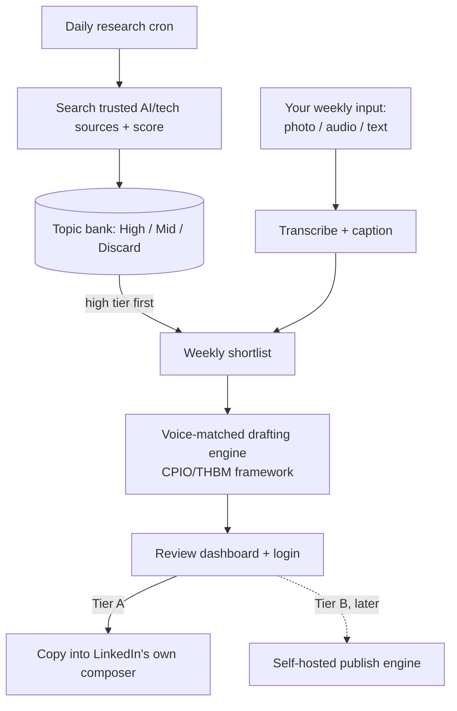

# Personal LinkedIn Content Engine — Full Project Specification

A semi-automated content system for your own personal LinkedIn presence: daily AI/market
research, a curated topic bank, voice-matched drafting using the CPIO/THBM content
framework, and a reviewed publish step. Everything below reflects what's actually
running, not the original pre-build plan — see `CLAUDE.md` for the full build history
and the reasoning behind each deviation (self-hosted Ollama instead of a paid vendor,
Tavily instead of a search-grounded model, etc.).

---

## 1. Weekly cadence

| Post type | Target | Pulled from | If nothing's available that week |
|---|---|---|---|
| AI commentary | 2/week | Topic bank, `ai` category, high tier | Drop to mid tier before skipping |
| Market commentary | 1/week | Topic bank, `market` category | Flexes into a second AI commentary — never force a non-post |
| Personal reflection | 1/week | Your weekly input (see §3) | Flexes into a curated repost + short commentary from the bank |

**3–4 posts a week, not 5.** A cadence that's consistent at 3–4 beats one that's
ambitious for a month and stalls. The bank existing (§2) is what makes the "flex"
fallbacks credible instead of hollow — there's always something decent sitting in
reserve rather than nothing.

Within that cadence, each post is also assigned a funnel stage (TOF/MOF/BOF) and a set
of execution variables (hook posture, length, structural format, media pairing) by the
CPIO/THBM drafting framework — see §3c.

---

## 2. Architecture overview

Two things run on their own every day with no human involved — the research scan and
the scoring. Everything else waits for a person: you supply the week's raw material
whenever it's easiest, and nothing reaches LinkedIn until it's been reviewed in the
dashboard.

---

## 3. Components

### 3a. Daily research engine + topic bank

Runs once a day, continuously building a backlog, so the weekly shortlist picks from
something already curated instead of researching from scratch under time pressure.

**Source policy**: open web search, not restricted to a curated allow list (request:
"open up where you can get info from") — `drafting_engine/research.py`'s
`EXCLUDED_DOMAINS` is a deny list instead, excluding specific low-reputation/
non-primary categories: tertiary reference content (Wikipedia, WikiHow, Britannica),
unmoderated user-generated content (Reddit, Quora, Answers.com, Ask.com, Pinterest),
open self-publishing platforms with no editorial process (Medium, Substack), and
generic SEO/listicle/content-marketing sites (BuzzFeed, WordStream, HubSpot). Opening
the search up shifts more of the quality judgment onto scoring (below), which now
explicitly evaluates source credibility itself rather than relying on a pre-filtered
list.

**Scoring**: every finding a daily search returns gets classified — **High** (specific,
current — today to ~1 week old, or older but still fully valid and timely — real post
potential), **Mid** (relevant and still valid but less time-sensitive, roughly 1-4 weeks
old), **Discard** (off-topic, low quality, genuinely stale, or a near-duplicate of
something already banked). Dedup runs before storage via lexical similarity against
recent bank entries — no embeddings needed at this scale (§4, LLM08).

**Storage**: `topic_bank` — `id, date_found, summary, source_title, source_url, tier,
category (ai/market), used, date_used`. The weekly shortlist queries this table for
unused High-tier rows first, Mid second — it doesn't trigger a fresh search itself.

### 3b. Your weekly input — photo, audio, or text

The design goal: whatever's least effort in the moment is a valid way to get
information into the system, because the alternative is the personal post stops
happening within a month.

| You send | Pipeline does |
|---|---|
| Text note | Used directly |
| Voice note | Transcribed (self-hosted faster-whisper) into raw notes |
| Photo | Captioned by Gemini vision for context, and kept to attach to the finished post |

No video processing anywhere (hard rule) — a video upload is rejected outright rather
than silently processed or ignored. All input types collapse into the same "raw notes"
input the drafting engine already expects (§3c).

### 3c. Voice-matched drafting engine — CPIO/THBM framework

The voice-profile pipeline (corpus → keyness stats + structural stats + LLM close read
→ merged voice profile, `voice_engine/`) feeds the drafting call's system prompt as its
voice block.

The drafting call itself (`drafting_engine/draft.py`) implements a fixed content
methodology on top of that voice:

- **CPIO planning** (Convey / Package / Information / Order) — the model works out the
  single point a post must communicate and the fact/anecdote set that supports it,
  before writing.
- **THBM execution levers** (Topic/funnel objective, Hook, Body, Media) — each post is
  assigned a funnel stage (TOF/MOF/BOF), a hook posture, a length bucket, a structural
  format, and a media pairing.
- **Anti-fatigue rotation**: these variables are chosen deterministically in Python
  (`drafting_engine/rotation.py`), excluding whatever the last 3 posts used, and the
  weekly funnel ratio (Alpha/Beta/Gamma) rotates by ISO week — never left to the model
  to "remember," per the pattern that already fixed two earlier reliability bugs in
  this codebase (see CLAUDE.md).
- **Negative constraints** (no em dash, no corporate jargon, no rhetorical questions,
  no reversal framing, no sycophantic openers) are enforced both in the prompt and, for
  the em dash specifically, by a deterministic regex on the way out.
- **6-gate audit check** — a second, narrow LLM call checks the draft against
  Convey/Hook/Payoff/Scannability/Anti-Fatigue/Speech-test, with one retry if it fails.

Runs against self-hosted Ollama by default; can be switched to Gemini via
`DRAFT_LLM_PROVIDER=gemini` in `.env`. The privacy/PII scrub call (see §4, LLM02)
always stays on Ollama regardless of that setting.

### 3d. Review dashboard, with a real login

**Stack: Reflex** — a Python framework that compiles to a real FastAPI backend and
React/Next.js frontend, while only Python is written. Built-in auth, single-user login.

You see: the week's drafts organised by day, hashtags and suggested tags as editable
chips, the suggested posting day, the assigned funnel stage/hook posture/format/media
pairing, a compliance note, and an upload box for your weekly input, split across seven
focused pages (Home, Review, Accepted, Rejected, Topic Bank, Past Weeks, Settings).

**Stats and engagement tracking.** Every draft's lifecycle is logged in `posts` — see
§9 for the full column list. Each state change gets its own timestamp, which is what
makes "time between steps" possible. The dashboard surfaces published/drafted/rejected
counts, an acceptance rate, and average time at each stage. Rejecting a draft has an
optional one-tap reason chip ("not relevant" / "wrong tone" / "already covered").

Likes and comments are entered manually — LinkedIn doesn't give third-party apps read
access to engagement numbers, so there's no way to pull these automatically. A simple
editable field on each published post lets you log them whenever you check LinkedIn.

### 3e. Publish — Tier A now, Tier B later

Unchanged: Tier A is copy-and-paste into LinkedIn's own composer (real clickable tags,
no API risk, built first); Tier B is auto-publish through a self-hosted engine like
Postiz or trypost, worth adding once Tier A is proven out. The one Node.js piece, if it
happens — a separate service called over its own API, never merged into this Python
codebase.

---

## 4. Safeguarding — mapped to OWASP's Top 10 for LLM Applications

| OWASP category | Where it bites in this project | Mitigation |
|---|---|---|
| LLM01 Prompt Injection | Daily research pulls raw web text; a compromised page could contain hidden instructions | Fetched content is treated strictly as reference data in a clearly delimited block; the drafting system prompt is instructed to ignore any instruction-like text found inside it |
| LLM02 Sensitive Info Disclosure | Your raw weekly notes might name a real private third party | Two-layer PII/privacy scrub before anything reaches a drafting call: an LLM rewrite (with retry) plus a deterministic money-figure regex, then a second independent LLM call verifies the rewrite; an unresolved case surfaces a loud compliance_note rather than reading as "no concerns" |
| LLM03 Supply Chain | Self-hosted open-source pieces (Postiz/trypost under Tier B, any pip packages) | Pin versions, review before deploying, no blind auto-updates |
| LLM04 Data/Model Poisoning | The voice-sample corpus could be tampered with if anyone else can add to it | Single-user system — only you can add voice samples |
| LLM05 Improper Output Handling | Drafting output is parsed as structured data and, under Tier B, could feed straight into a publish call | Validate the schema before it's used anywhere; nothing renders or publishes without passing validation |
| LLM06 Excessive Agency | "As automated as possible" pushes naturally toward letting the system act alone | Publish stays behind an explicit approve click regardless of tier — the system drafts, it never decides to post |
| LLM07 System Prompt Leakage | Your voice profile lives inside the system prompt | The drafting call runs server-side (Reflex's FastAPI backend), so the prompt never reaches the browser |
| LLM08 Vector/Embedding Weaknesses | Bank dedup uses lexical similarity, not embeddings, at this scale | Revisit access control if that ever changes |
| LLM09 Misinformation | Research or drafting could get a fact wrong | Every factual claim in a researched post must trace to a captured source URL from that same run; you remain the final human check, not an automated flag alone |
| LLM10 Unbounded Consumption | Daily cron + always-on search could run away in cost if something misbehaves | Ollama is free/local for drafting; Tavily has a monthly usage counter (`usage_tracking.py`) stopping new searches at 900/month, under the real 1000 cap |

---

## 5. Tech stack

| Layer | Choice | Why |
|---|---|---|
| Language | Python, throughout | One codebase, VS Code-native |
| Backend + dashboard | Reflex (→ FastAPI + React/Next.js) | Localhost-only, single-user, no login (still pure Python to write) |
| Drafting | Self-hosted Ollama (`llama3`), switchable to Gemini via `DRAFT_LLM_PROVIDER` | Free, local, keeps raw personal notes off third-party APIs by default |
| Research | Tavily search API, open web with a deny list for low-reputation sources | Genuinely free (1000 searches/month), built for feeding LLMs |
| Scoring / photo captioning | Gemini free tier (`gemini-flash-lite-latest`) | Free-tier API is fine here — no sensitive personal writing passes through these two calls |
| Transcription | Self-hosted faster-whisper (open weights) | Genuinely free, nothing leaves the machine |
| Database | SQLite | Free, no extra service needed at this scale |
| Scheduling | Windows Task Scheduler, daily trigger per job plus "at log-on" as a catch-up net | Free, no extra infrastructure, doesn't require the machine to be always on |
| Hosting | Localhost only, launched via `Start Content Engine.bat` | Single machine, single user — no network/cloud hosting built |
| Publish, Tier B only | Self-hosted Postiz or trypost | The one Node.js piece, if it happens — a separate service, not part of this codebase |

---

## 6. Cost

| Item | Monthly |
|---|---|
| Drafting (Ollama) | £0 — self-hosted |
| Research (Tavily) | £0 — free tier, usage-capped in code |
| Scoring / photo captioning (Gemini) | £0 — free tier |
| Transcription | £0 — self-hosted faster-whisper |
| Hosting | £0 — localhost only |
| Database | £0 — SQLite |
| Postiz/trypost, Tier B only | £0 software + a small server cost if built |

Genuinely free end to end at this volume, as long as `DRAFT_LLM_PROVIDER` stays on
`ollama`. Switching to Gemini for drafting introduces real per-call cost outside a
covered subscription — confirm pricing before flipping that switch.

---

## 7. Build sequence — seven levels, each with a done-when check

1. **Environment & project setup** — Python venv, repo structure, database provisioned,
   `.env` with API keys, `requirements.txt`. Done when a hello-world Reflex/FastAPI app
   runs locally and connects to the database.
2. **Database schema** — every table in §9 created via migration. Done when all tables
   exist and can be queried.
3. **Voice engine** — corpus ingestion → keyness analysis + structural analysis + LLM
   close read → merged voice profile. Done when running it on a real corpus, even a
   small one, produces a profile that visibly reflects the input.
4. **Drafting + research engine** — topic in, structured draft out (text, hashtags,
   tags, suggested day, sources, compliance note, THBM rotation fields).
5. **Daily research cron + topic bank** — the scheduled job that populates the bank
   daily. Done when, left running unsupervised, the bank accumulates real,
   non-duplicate, correctly-tiered entries.
6. **Multimodal capture** — upload widget (photo/audio/text) feeding the raw-notes
   pipeline. Done when each input type produces usable notes for the drafting engine.
7. **Reflex dashboard** — full UI: weekly drafts by day, editable chips, the stats
   panel, manual likes/comments entry, real login, upload box, topic bank visibility.
   Done when a full weekly cycle — bank populates, shortlist forms, drafts generate,
   you review and approve or reject, stats update — runs end to end without touching
   code.

See `CLAUDE.md` for the actual build log, including every real bug hit and how it was
fixed at each level.

---

## 8. Data model (consolidated)

**`topic_bank`**
`id, date_found, summary, source_title, source_url, tier (high/mid/discard), category
(ai/market), used (bool), date_used`

**`posts`**
`id, post_type (ai_commentary/market_commentary/personal_reflection), status
(drafted/approved/rejected/published), draft_text, hashtags, tags, suggested_day,
sources, compliance_note, source_bank_id (FK → topic_bank), created_at, reviewed_at,
published_at, rejection_reason, likes, comments, engagement_updated_at, scheduled_week,
funnel_stage, hook_posture, length_bucket, structural_format, media_pairing, media_note`

**`voice_samples`**
`id, source_type (linkedin_post/audio_transcript), raw_text, date_added`

**`voice_profile`**
`id, generated_at, profile_json` — one row, regenerated as the corpus grows

**`job_runs`** (scheduler state)
`job_name, last_run_at` — checked before the daily research/email jobs run, to support
the catch-up-on-next-activation scheduling pattern

**`forced_topic`**, **`api_usage_counter`**, **`planned_note`**, **`email_settings`** —
see `models.py` for the full definitions; added after the original spec, documented in
`CLAUDE.md`.

**Auth** — handled by `reflex-local-auth`, one user to start.

---

## 9. Optional extras — not yet built

- Two draft variants per post (punchier vs. more explanatory)
- Drift check — periodically re-score a sample of generated drafts against the voice
  profile's own stats, to catch the voice quietly slipping over time
- A real publish tier (Tier B) once Tier A copy-paste is proven out over a few weeks
