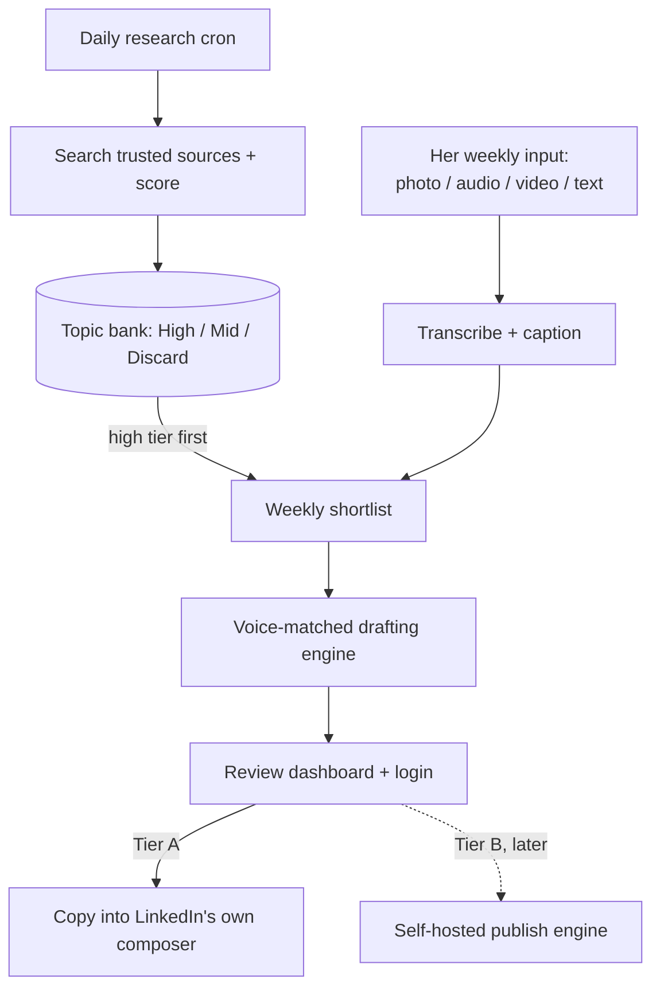

# WPA LinkedIn Content Engine â Full Project Specification

A semi-automated content system for a WPA-affiliated healthcare adviser: daily research, a curated topic bank, voice-matched drafting, and a reviewed publish step. Everything below assumes the corrections on the previous page â WPA, not WPS/WSP; OpenAI as the single paid vendor; nothing installed on her work machine at any point.

---

## 1. Weekly cadence

| Post type | Target | Pulled from | If nothing's available that week |
|---|---|---|---|
| Industry insight | 2/week | Topic bank, high tier | Drop to mid tier before skipping |
| Company update | 1/week | Topic bank, WPA-tagged items | Flexes into a third industry insight â never force a non-update |
| Personal reflection | 1/week | Her weekly input (see §3) | Flexes into a curated repost + short commentary from the bank |

**3â4 posts a week, not 5.** She's already said personal posting isn't her comfort zone, and a account that's consistent at 3â4 beats one that's ambitious for a month and stalls. The bank existing (§2) is what makes the "flex" fallbacks credible instead of hollow â there's always something decent sitting in reserve rather than nothing.

---

## 2. Architecture overview

Two things run on their own every day with no human involved â the research scan and the scoring. Everything else waits for a person: she supplies the week's raw material whenever it's easiest for her, and nothing reaches LinkedIn until it's been reviewed in the dashboard.

---

## 3. Components

### 3a. Daily research engine + topic bank

Runs once a day, not just weekly â this is the change from the earlier plan. Rather than a cold start every Monday, it continuously builds a backlog, so the weekly shortlist is picking from something already curated instead of researching from scratch under time pressure.

**Trusted sources (starting list â refine with her):**

| Allow | Deny |
|---|---|
| wpa.org.uk (WPA's own newsroom) | Generic "best insurance" comparison/SEO content |
| nhs.uk, england.nhs.uk | Unmoderated forums as factual sources |
| gov.uk (DHSC, ONS health data) | Any source that can't be traced to a real publication or body |
| abi.org.uk (Association of British Insurers) | |
| Health & Protection, Cover, Money Marketing (UK trade press) | |
| moneyfactscompare.co.uk (for award/ranking claims) | |

**Scoring**: every finding a daily search returns gets classified â **High** (specific, current, real post potential), **Mid** (relevant but not urgent, worth banking), **Discard** (off-topic, low quality, or a near-duplicate of something already banked). Dedup runs before storage: a new finding gets compared against recent bank entries and dropped if it's substantially the same story.

**Storage** (one table is enough at this scale): `id, date_found, summary, source_title, source_url, tier, category, used, date_used`. The weekly shortlist step queries this table for unused High-tier rows first, Mid second â it doesn't trigger a fresh search itself.

### 3b. Her weekly input â photo, audio, video, or text

The actual design goal here: whatever's least effort for her in the moment is a valid way to get information into the system, because the alternative is she stops doing the personal post within a month.

| She sends | Pipeline does |
|---|---|
| Text note | Used directly |
| Voice or video note | Transcribed (OpenAI Whisper / gpt-4o-transcribe) into raw notes |
| Photo | Captioned by a vision-capable model for context, and kept to attach to the finished post |

All four collapse into the same "raw notes" input the drafting engine already expects (§3c) â this is an ingestion layer in front of the existing pipeline, not a separate system.

### 3c. Voice-matched drafting engine

This is the voice-profile pipeline already being planned in Python (corpus â keyness stats + structural stats + LLM close read â merged voice profile). No change here except the drafting call itself moves to OpenAI's Responses API, using the merged voice profile as the system prompt's voice block once it exists.

### 3d. Review dashboard, with a real login

**Stack: Reflex** â a Python framework that compiles to a proper FastAPI backend and a real React/Next.js frontend, while you only write Python. This matters for three things you asked for at once: it's one language start to finish (fits the VS Code / Python direction), it has built-in auth so nobody's hand-rolling a login system, and the output looks like real software rather than a Streamlit prototype â which is the "would someone pay for this" bar from the start of this project.

She sees: the week's drafts organised by day, hashtags and suggested tags as editable chips, the suggested posting time, a compliance note, and an upload box for her weekly input. You see the same, plus the topic bank underneath it if you want to intervene.

**Stats and engagement tracking.** Every draft's lifecycle is logged in a `posts` table â `id, post_type, status (drafted / approved / rejected / published), draft_text, source_bank_id, created_at, reviewed_at, published_at, likes, comments, engagement_updated_at`. Each state change gets its own timestamp, which is what makes "time between steps" possible without extra tracking work. The dashboard surfaces published/drafted/rejected counts, an acceptance rate, and average time at each stage, so drift â drafts piling up unreviewed, a rising rejection rate â is visible rather than something noticed by feel months later. Rejecting a draft has an optional one-tap reason chip ("not relevant" / "wrong tone" / "already covered") rather than a text box, so it costs her nothing but still builds a signal over time.

Likes and comments are entered manually â LinkedIn doesn't give third-party apps read access to engagement numbers any more freely than it gives posting access, so there's no way to pull these automatically. A simple editable field on each published post lets her log them whenever she happens to check LinkedIn. Once enough posts accumulate, this sets up the real question worth asking eventually: which post type is actually working, not just which one feels like it should be.

### 3e. Publish â Tier A now, Tier B later

Unchanged from before: Tier A is copy-and-paste into LinkedIn's own composer (real clickable tags, no API risk, build this first); Tier B is auto-publish through a self-hosted engine like Postiz or trypost, worth adding once Tier A is proven out. Full reasoning on why is in the earlier discussion â nothing about the LinkedIn API side has changed.

---

## 4. Safeguarding â mapped to OWASP's Top 10 for LLM Applications

This is a real, current framework (2025 edition), not a made-up checklist. Mapping each category to where it actually shows up here:

| OWASP category | Where it bites in this project | Mitigation |
|---|---|---|
| LLM01 Prompt Injection | Daily research pulls raw web text; a compromised page could contain hidden instructions | Fetched content is treated strictly as reference data in a clearly delimited block; the drafting system prompt is instructed to ignore any instruction-like text found inside it |
| LLM02 Sensitive Info Disclosure | Her raw weekly notes might name a real client or their condition | PII scrub before anything reaches the API; the model is told to flag rather than silently include anything that reads as identifying |
| LLM03 Supply Chain | Self-hosted open-source pieces (Postiz/trypost under Tier B, any pip packages) | Pin versions, review before deploying, no blind auto-updates |
| LLM04 Data/Model Poisoning | The voice-sample corpus could be tampered with if anyone else can add to it | Only she or you can add voice samples; review additions |
| LLM05 Improper Output Handling | Drafting output is parsed as structured data and, under Tier B, could feed straight into a publish call | Validate the schema before it's used anywhere; nothing renders or publishes without passing validation |
| LLM06 Excessive Agency | "As automated as possible" pushes naturally toward letting the system act alone | Publish stays behind an explicit approve click regardless of tier â the system drafts, it never decides to post |
| LLM07 System Prompt Leakage | Her voice profile lives inside the system prompt; today's prototype calls the API client-side, which exposes it in the browser | Move the API call server-side in the real build (Reflex's FastAPI backend does this naturally) so the prompt never reaches the browser |
| LLM08 Vector/Embedding Weaknesses | Only relevant if bank dedup ends up using embeddings | Standard access control on whatever store holds them, if you go that route |
| LLM09 Misinformation | Research or drafting could get a WPA fact wrong â a compliance problem here, not just an awkward correction | Every factual claim in a researched post must trace to a captured source URL from that same run; she remains the final human check, not an automated flag alone |
| LLM10 Unbounded Consumption | Daily cron + always-on search could run away in cost if something misbehaves | Hard token caps per call, plus a monthly spend cap set directly in the OpenAI dashboard as backstop |

---

## 5. Tech stack

| Layer | Choice | Why |
|---|---|---|
| Language | Python, throughout | One codebase, matches the voice engine already underway, VS Code-native |
| Backend + dashboard | Reflex (â FastAPI + React/Next.js) | Real auth, doesn't read as a generic prototype, still pure Python to write |
| Research + drafting | OpenAI Responses API, `web_search` tool | Native to the one paid vendor |
| Transcription | Self-hosted Whisper (open weights, not the API) | Genuinely free at this volume â a couple of short clips a week transcribes on a normal laptop CPU in under a minute, no GPU needed, nothing leaves your machine |
| Vision | OpenAI vision-capable model | Same vendor, captions her photos |
| Database | SQLite to start; Postgres via Supabase free tier if it grows | Free, no extra service needed at this scale |
| Scheduling | Windows Task Scheduler, two triggers on one task: daily at a set time, plus "at log-on" as a catch-up net | Free, no extra infrastructure, and doesn't require the machine to be on all the time â the job checks its own last-run date and catches up on whatever was missed rather than needing a fixed always-on server |
| Hosting | Free-tier VM (Oracle Cloud Free Tier / Fly.io) or Reflex's own hosting | Keeps to "free except OpenAI" |
| Publish, Tier B only | Self-hosted Postiz or trypost | The one Node.js piece â a separate service called over its own API, not part of your Python codebase |

---

## 6. Cost

| Item | Monthly |
|---|---|
| OpenAI API â research + drafting + vision, one client's volume, cheap model tier | roughly $1â3 |
| Transcription | £0 â self-hosted Whisper, not the API |
| Hosting | £0 (free tier) |
| Database | £0 (SQLite or Supabase free tier) |
| Postiz/trypost, Tier B only | £0 software + ~£5â8 for the small server it runs on |

**Why not self-host the drafting/research LLM too?** At one client's volume, renting the GPU power to run even a mid-size open model costs more per month than these API calls do â self-hosting only pays off once fixed server cost is spread across enough client volume to beat it. Worth revisiting properly once there are several clients on the platform, not before. Free API tiers for open models exist (Groq, Gemini) and could work volume-wise, but most are funded by training on your prompts â not something to route her actual content through given the compliance stakes, even for the saving.

---

## 7. Build sequence â seven levels, each with a done-when check

Build and verify one level before starting the next, even where it looks safe to skip ahead â level 5 in particular depends on level 2's schema being right, and schema mistakes are expensive to unwind once the bank has real data in it.

1. **Environment & project setup** â Python venv, repo structure, database provisioned, `.env` with API keys, `requirements.txt`. Done when a hello-world Reflex/FastAPI app runs locally and connects to the database.
2. **Database schema** â every table in §9 created via migration. Done when all tables exist and can be queried.
3. **Voice engine** â corpus ingestion (LinkedIn posts + optional transcribed recordings) â keyness analysis + structural analysis + LLM close read â merged voice profile. Done when running it on a real corpus, even a small one, produces a profile that visibly reflects the input rather than generic placeholders.
4. **Drafting + research engine** â the two-call pattern already prototyped, rebuilt against the chosen inference stack (self-hosted Ollama for drafting, free tier for research â §5). Done when a topic in produces a structured draft (text, hashtags, tags, suggested day, sources, compliance note) matching the schema already defined.
5. **Daily research cron + topic bank** â the scheduled job (Task Scheduler dual-trigger plus catch-up logic, §5) that populates the bank daily. Done when, left running for a few days unsupervised, the bank accumulates real, non-duplicate, correctly-tiered entries.
6. **Multimodal capture** â upload widget (photo/audio/video/text) feeding the same raw-notes pipeline; audio to self-hosted Whisper, photo to a captioning model. Done when each input type produces usable notes for the drafting engine.
7. **Reflex dashboard** â full UI: weekly drafts by day, editable chips, the stats panel (§3d), manual likes/comments entry, real login, upload box, topic bank visibility. Done when a full weekly cycle â bank populates, shortlist forms, drafts generate, she reviews and approves or rejects, stats update â runs end to end without touching code.

---

## 8. Only she (or WPA's compliance function) can answer these

- The exact company name/spelling, direct from her â a fast check worth doing even though WPA is very likely correct
- Who actually signs off on the compliance rules before this goes live â not something either of us can determine from outside
- Whether she's comfortable with event photos â which often include other people who haven't agreed to appear in a company's marketing content â being read by an AI vision model and potentially posted. Worth asking her directly; it's a normal photo-courtesy question, not really an AI-specific one

---

## 9. Data model (consolidated)

**`topic_bank`**
`id, date_found, summary, source_title, source_url, tier (high/mid/discard), category (industry/company), used (bool), date_used`

**`posts`**
`id, post_type, status (drafted/approved/rejected/published), draft_text, source_bank_id (FK â topic_bank), created_at, reviewed_at, published_at, rejection_reason, likes, comments, engagement_updated_at`

**`voice_samples`**
`id, source_type (linkedin_post/audio_transcript), raw_text, date_added`

**`voice_profile`**
`id, generated_at, profile_json` â one row, regenerated as the corpus grows; holds the lexical stats, structural stats, LLM close-read notes, and curated few-shot examples together

**`job_runs`** (scheduler state)
`job_name, last_run_at` â checked by the daily research job before it does anything, to support the catch-up-on-next-activation scheduling pattern (§5)

**Auth** â handled by Reflex's built-in auth, one user (her) to start. Worth keeping loose enough that a `clients` table could sit above all of this later without a rewrite (see §10).

---

## 10. Optional extras â proposed in planning, not yet confirmed

Cheap to add now, expensive to retrofit later. Included below by default since nothing was said against them â cut freely if you'd rather keep the first build lean:

- Two draft variants per post (punchier vs. more explanatory)
- Weekly reminder email with that week's drafts and a dashboard link
- Drift check â periodically re-score a sample of generated drafts against the voice profile's own stats, to catch the voice quietly slipping over time
- A `clients` table instead of hardcoding her and WPA specifically, so a second client doesn't mean a rewrite
- Spend visibility widget on the dashboard, pulled from usage data already being tracked for the bank
- One-click pause switch for the week
